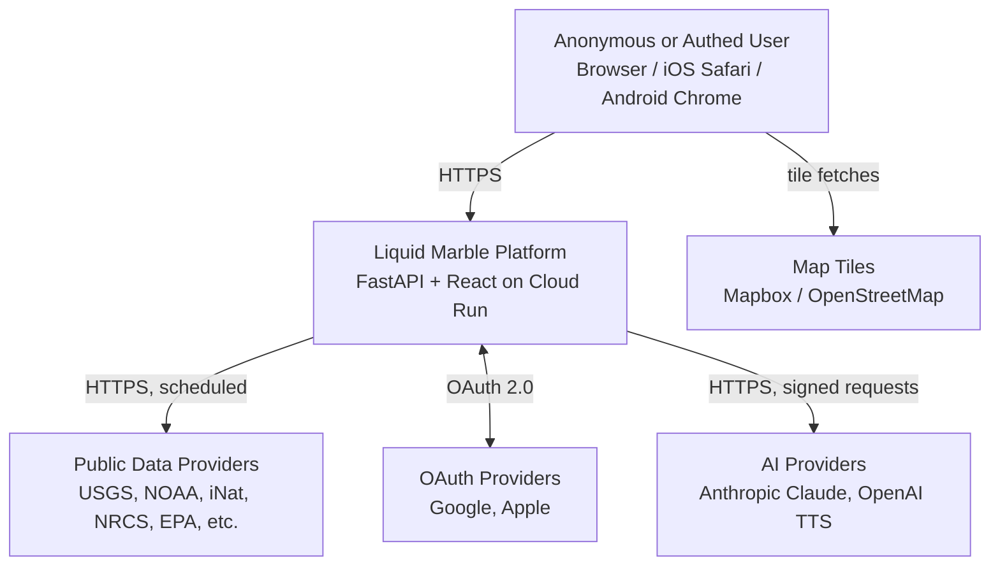
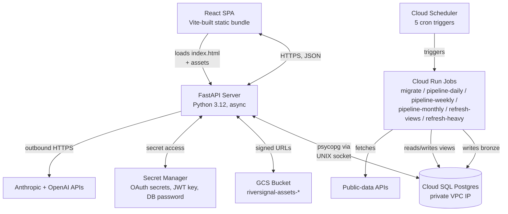
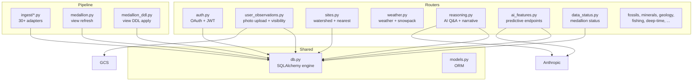
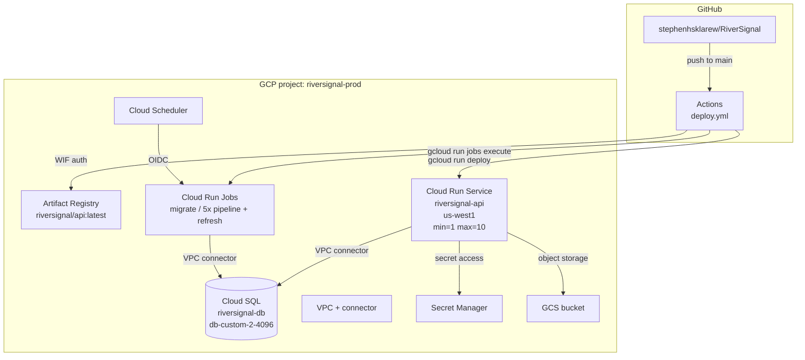
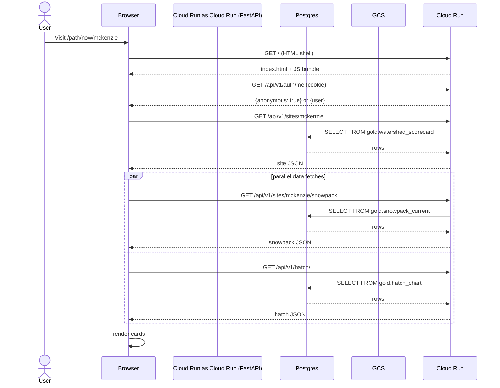

---
dun:
  id: helix.architecture
  depends_on:
    - helix.prd
---
# Architecture

## Level 1: System Context

| Element | Type | Purpose | Protocol |
|---------|------|---------|----------|
| User | External | Browses three apps; optional sign-in | HTTPS |
| Liquid Marble Platform | System (us) | Backend + frontend served from one Cloud Run service | — |
| Public Data Providers | External | 30+ federal/state/academic sources | HTTPS REST/JSON |
| OAuth Providers | External | Google + Apple Sign-In | OAuth 2.0 |
| AI Providers | External | Narrative + TTS audio | HTTPS REST |
| Map Tiles | External | Background map raster | HTTPS tile fetches |

## Level 2: Container Diagram

| Container | Technology | Responsibilities | Communication |
|-----------|------------|------------------|---------------|
| React SPA | React 19 + Vite + TypeScript | All UI for `/`, `/path/*`, `/trail/*`, `/riversignal/*`, `/status` | Static; calls API via `fetch` |
| FastAPI Server | Python 3.12, FastAPI, SQLAlchemy, Pydantic | All HTTP endpoints; auth; AI proxy | Serves SPA + JSON API |
| Cloud SQL | Postgres 17 | Bronze tables, silver/gold materialized views, user data | Private VPC; psycopg via socket |
| GCS Bucket | Google Cloud Storage | Photo observation uploads; cached audio | Signed URLs for private items |
| Secret Manager | GCP managed | OAuth client secrets, JWT key, DB pwd, AI keys | IAM-scoped per Cloud Run SA |
| Cloud Run Jobs | Same image as API; different command | Schema migration, ingestion, view refresh | One-shot; service-account auth |
| Cloud Scheduler | GCP managed | Cron triggers for jobs | OIDC tokens to Cloud Run |

## Level 3: Component Diagram (FastAPI server)

| Component | Purpose | Implementation Notes |
|-----------|---------|---------------------|
| `app/routers/auth.py` | OAuth flows (Google + Apple), JWT issuance, session mgmt | `python-jose` for JWT; httpOnly cookie |
| `app/routers/user_observations.py` | Photo upload, visibility filter, EXIF | Visibility flag in `data_payload`; filter applied at every public surface |
| `app/routers/sites.py` | Watershed metadata + nearest-site queries | Allow-list of watershed names |
| `app/routers/reasoning.py` | AI narrative + Q&A | Retrieval-augmented prompts grounded in warehouse |
| `app/routers/ai_features.py` | Predictive model serving | 5 models loaded at startup |
| `app/routers/data_status.py` | `/status` page data | Cached counts; recomputed daily |
| `pipeline/ingest/*.py` | Source-specific ingestion adapters | One per source; uniform interface |
| `pipeline/medallion.py` | Refresh-views logic | CONCURRENTLY where unique index exists |
| `pipeline/medallion_ddl.py` | Re-create views from `medallion_views.sql` | Idempotent |
| `pipeline/db.py` | SQLAlchemy engine factory | Reads `DATABASE_URL` from env |

## Deployment

| Component | Infrastructure | Instances | Scaling |
|-----------|---------------|-----------|---------|
| Cloud Run service `riversignal-api` | Container (managed) | 1–10 | Horizontal autoscale on request rate |
| Cloud Run jobs (6) | Container (managed; one-shot) | 0–1 each | None (single execution) |
| Cloud SQL `riversignal-db` | db-custom-2-4096 (2 vCPU / 4 GB) | 1 | Vertical only — increase tier in Terraform |
| GCS bucket | Multi-regional (US) | n/a | Object count |
| VPC connector | e2-micro | min=2 max=3 | Throughput-based |

## Data Flow — example: user opens `/path/now/mckenzie`

## Architecture Summary

| Layer | Technology | Rationale |
|-------|------------|-----------|
| Frontend | React 19 + Vite + TypeScript | SPA bundle; no SSR needed (mostly logged-out reads); fast dev HMR |
| Backend | FastAPI on Python 3.12 | Async-friendly, auto-OpenAPI docs, Pydantic validation, well-suited for I/O bound API + DB workload |
| Database | Postgres 17 (Cloud SQL) + medallion (bronze/silver/gold) | Relational + JSONB strikes the right balance for heterogeneous public data; materialized views give cheap reads |
| Auth | OAuth 2.0 (Google + Apple) + JWT cookie | Federated — no password storage; httpOnly cookie minimizes XSS theft surface |
| AI | Anthropic Claude (narrative) + OpenAI TTS (audio) | Best-in-class quality; aggressive caching keeps cost bounded |
| Storage | GCS for user photos + audio | Signed URLs for private items; cheap object storage |
| Infra | Terraform on GCP | Reproducible; single-engineer-friendly; managed services minimize ops |
| CI/CD | GitHub Actions with Workload Identity Federation | No static service account keys; deploy-on-push to main |

**Patterns**:
- **Medallion warehouse**: bronze (raw) → silver (clean) → gold (aggregate). Reads always hit gold.
- **Anonymous-first**: every read endpoint optional-auth via `get_optional_user`.
- **Retrieval-augmented narrative**: AI responses are grounded by warehouse rows, not raw LLM.
- **Frontend-served-from-backend**: a single Cloud Run service serves both API and built SPA bundle. Simpler ops, same origin avoids CORS in prod.

## Quality Attributes

| Attribute | Strategy | Key Decisions |
|-----------|----------|---------------|
| Scalability | Horizontal autoscale Cloud Run; vertical Cloud SQL; gold views absorb read load | Cloud Run min=1 keeps cold starts off the user path |
| Security | Federated auth, secrets in Secret Manager, private VPC DB, httpOnly cookies, view-level visibility filter | See `01-frame/security-requirements.md` and `01-frame/threat-model.md` |
| Observability | Cloud Logging request logs; per-source ingestion job logs; daily roll-up of API + AI cost (TODO) | Add `request.user_id` log field for cost attribution |
| Disaster Recovery | RTO: 4h / RPO: 24h | Cloud SQL automated backups (14d); Terraform IaC reconstructs everything else; bronze re-ingestible from sources within 72h |

## See Also

- `02-design/adr/` — individual architectural decision records
- `02-design/plan-*.md` — solution-design plans for each major build wave
- `02-design/technical-design-photo-observations.md` — story-level design example
- `01-frame/threat-model.md` — security boundaries and STRIDE analysis
